# Tableau Dashboards
Tableau dashboards built during my Data Analytics learning journey.

## Video Games Sales Dashboard
Analysis of top 10 platforms, publishers and genres by sales.
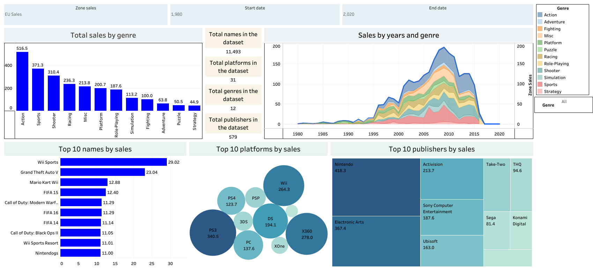
**Live dashboard:** [View on Tableau Public](https://public.tableau.com/app/profile/dusan.mamula/vizzes)

## IBM HR Dashboard
Employee data analysis including attrition, salary and demographics.
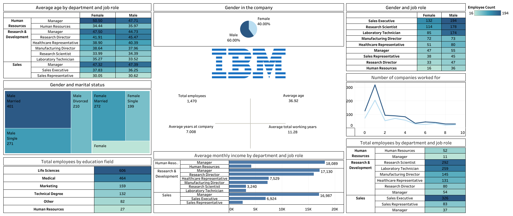
**Live dashboard:** [View on Tableau Public](https://public.tableau.com/app/profile/dusan.mamula/vizzes)

## Tripadvisor Hotels Dashboard
Hotel ratings, traveler types, room counts and locations.
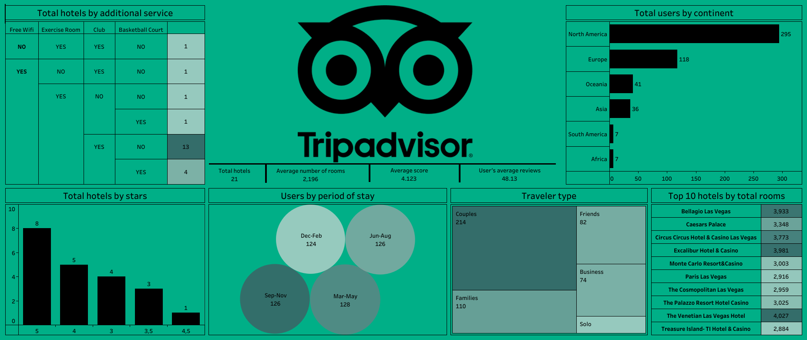
**Live dashboard:** [View on Tableau Public](https://public.tableau.com/app/profile/dusan.mamula/vizzes)

## Data Science Salaries Dashboard
Salary trends by experience level, employment type and country.
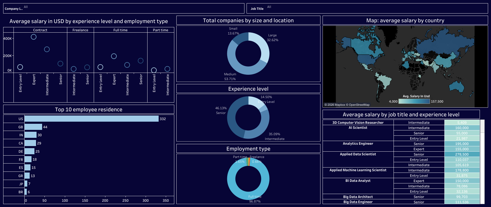
**Live dashboard:** [View on Tableau Public](https://public.tableau.com/app/profile/dusan.mamula/vizzes)

## Netflix Dashboard
Interactive dashboard analyzing Netflix content library.
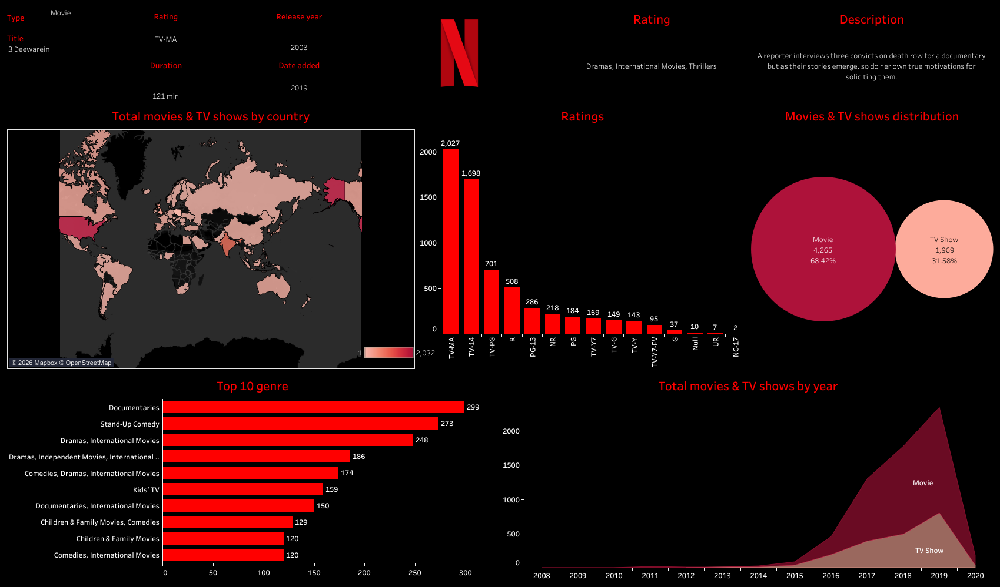
**Live dashboard:** [View on Tableau Public](https://public.tableau.com/app/profile/dusan.mamula/viz/Netflixdashboard_17804145082950/Netflix)

## Olympics Dashboard
Historical analysis of Olympic Games, athlete demographics, and medal distributions.
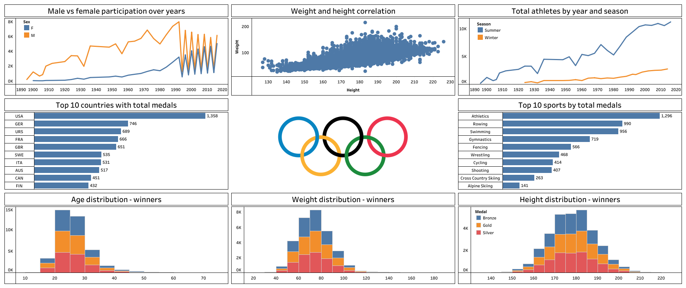
**Live dashboard:** [View on Tableau Public](https://public.tableau.com/app/profile/dusan.mamula/vizzes)

## World Cup Dashboard
Comprehensive overview of FIFA World Cup history, including winning countries, host stats, and audience distribution.

**Live dashboard:** [View on Tableau Public](https://public.tableau.com/app/profile/dusan.mamula/vizzes)

## Friends TV Show Dashboard
Analysis of the iconic sitcom, covering episode counts, director tracking, IMDb ratings, and voting trends across seasons.
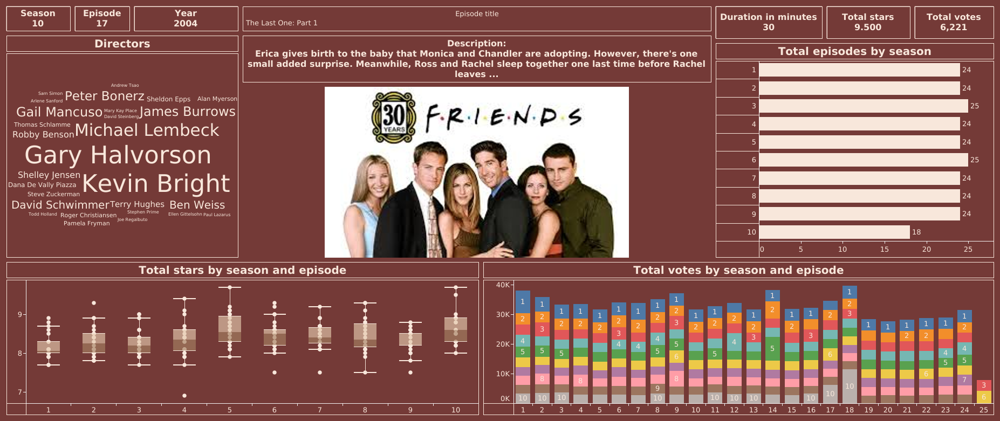
**Live dashboard:** [View on Tableau Public](https://public.tableau.com/app/profile/dusan.mamula/vizzes)

## Amazon Prime Dashboard
Interactive analysis of Amazon Prime's content library, showcasing genres, release years, and show types.

**Live dashboard:** [View on Tableau Public](https://public.tableau.com/app/profile/dusan.mamula/vizzes)

## Uber Bookings Dashboard
Analysis of ride-hailing data, focusing on booking values, revenue by pickup location, and trip distances.
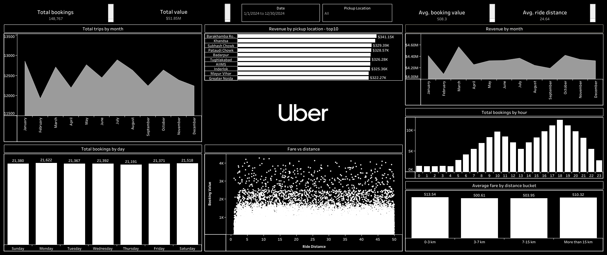
**Live dashboard:** [View on Tableau Public](https://public.tableau.com/app/profile/dusan.mamula/vizzes)

## Amazon India Sales Dashboard
E-commerce operations tracking, focusing on sales quantity, courier status, and state-wise order distribution in India.
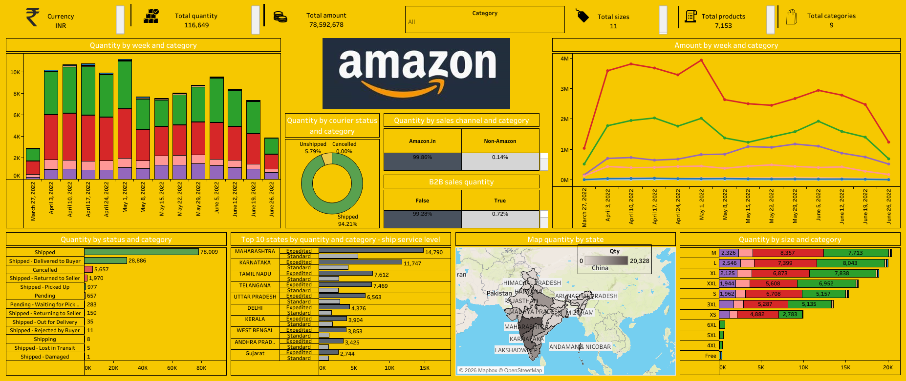
**Live dashboard:** [View on Tableau Public](https://public.tableau.com/app/profile/dusan.mamula/vizzes)

## Adidas Sales Dashboard
Retail business overview analyzing total sales, operating profit margins, and distribution channels across regions.
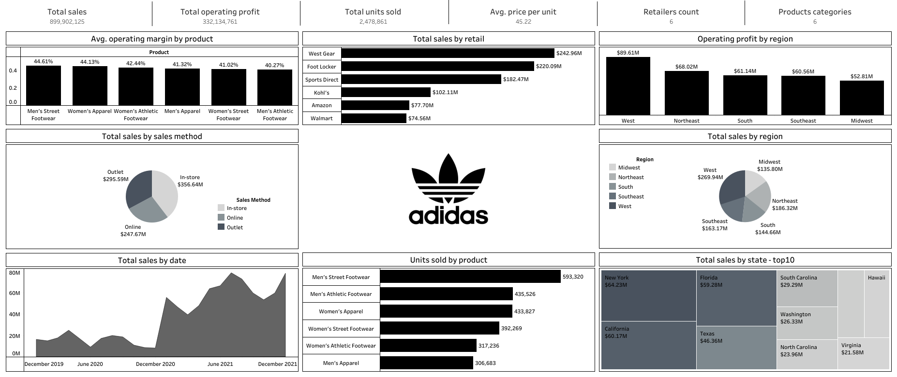
**Live dashboard:** [View on Tableau Public](https://public.tableau.com/app/profile/dusan.mamula/vizzes)

## Goodreads Books Dashboard
Exploration of literary data, tracking top authors, publishers, and top-rated book titles based on reader reviews.
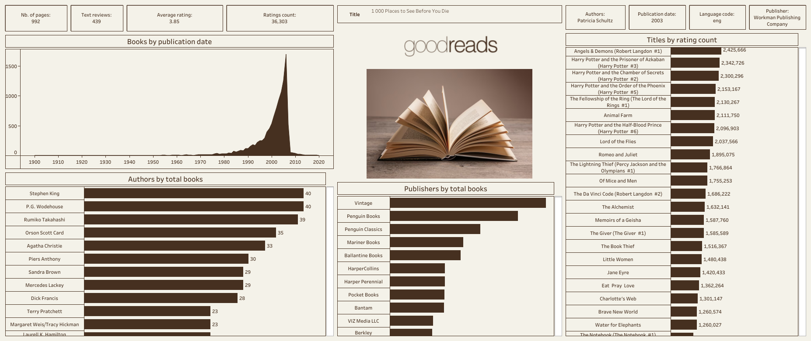
**Live dashboard:** [View on Tableau Public](https://public.tableau.com/app/profile/dusan.mamula/vizzes)

## Breaking Bad Dashboard
Deep dive into the critically acclaimed TV show, analyzing episode lengths, viewer numbers, and director insights.
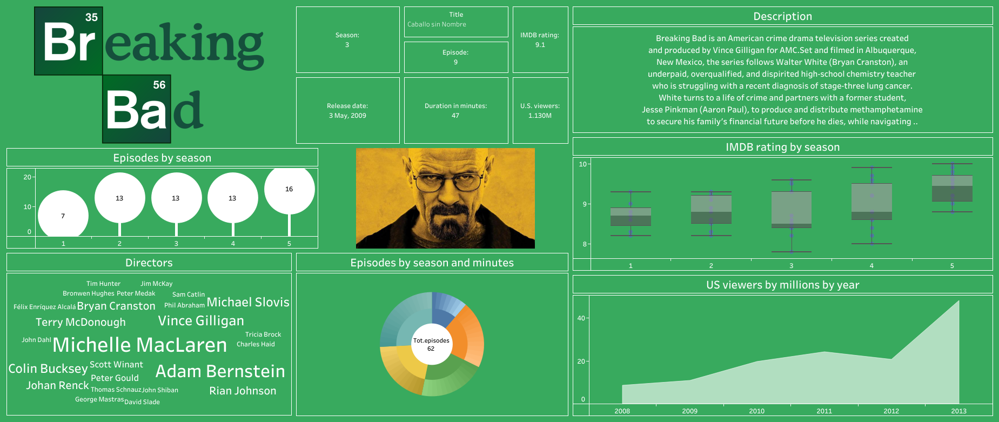
**Live dashboard:** [View on Tableau Public](https://public.tableau.com/app/profile/dusan.mamula/vizzes)

## IMDb Movies Dashboard
Comprehensive film industry analysis, covering movie gross earnings, certificates, genres, and critical meta scores.
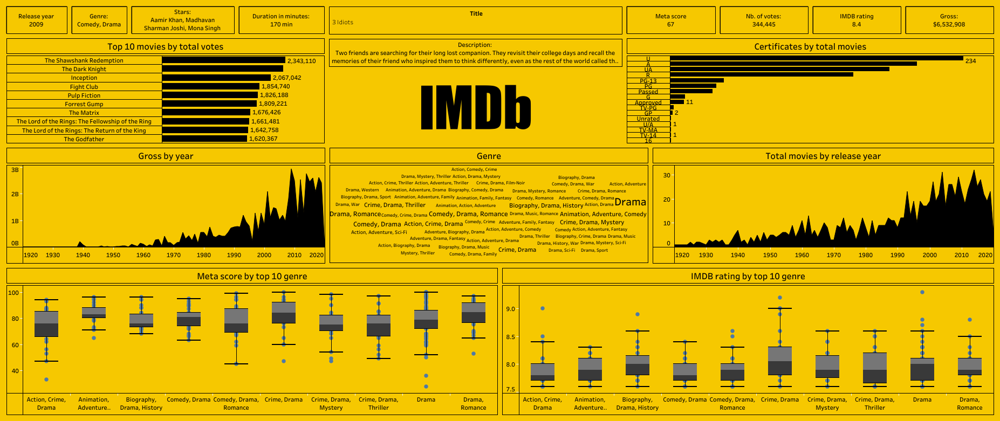
**Live dashboard:** [View on Tableau Public](https://public.tableau.com/app/profile/dusan.mamula/vizzes)

## Skills used
Tableau, Data Visualization, Advanced Charting (Box Plots, Treemaps, Donut Charts), Geospatial Analysis, Dashboard Design, Data Filtering
